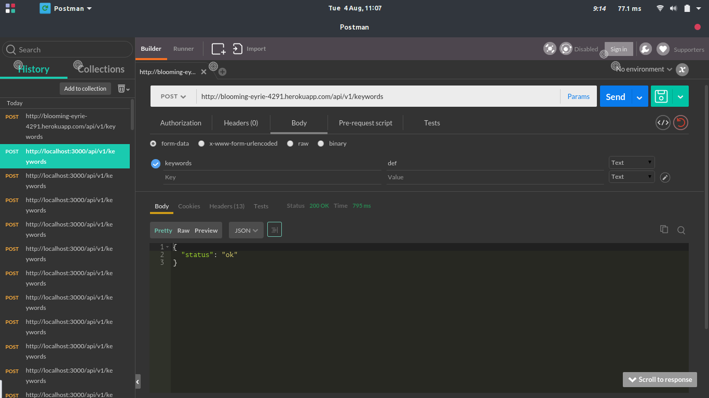

# README

This is my attempt to Zeemi technical test for developer. The app is a web app that
will extract large amounts of data from google search results page. And then
store the data and display it in form of report page.
Users should be authenticated to use this application.
And the application should provide OAuth 2 Restful JSON API.

## SOME TECHNICAL REQUIREMENTS

* Ruby version 2.1.4

* Rails version 4.2.3

* Database PostgreSQL

* Front-end Framework using Bourbon, Neat, Refills and SASS.

* URL: https://blooming-eyrie-4291.herokuapp.com/
* API Endpoint: https://blooming-eyrie-4291.herokuapp.com/api/v1/
* API for keyword entries example.

## TO DONE

- [x] Authenticated users can upload a CSV file of keywords.
- [x] API for keywords entries.
- [ ] OAUTH2 authentication
- [X] Uploaded keywords run search on google.com automatically.
- [ ] Each search result / keyword result page on Google store some detailed information:
- [X] a. Number of AdWords advertisers in the top position.
- [X] b. Number of AdWords advertisers in the right side position.
- [X] c. Total number of AdWords advertisers on the page.
- [ ] d. Display URLs of the AdWords advertisers in the top position.
- [ ] e. Display URLs of the AdWords advertisers in the right side.
- [X] f. Number of the non-AdWords result on the page.
- [ ] g. URLs of the non-AdWords result on the page.
- [ ] h. Total number of links (all of them) on the page
- [X] i. Total search resultsfor this keywords e.g. About 21,600,000 results (0.42 seconds).
- [ ] j. HTML code of the page/cache of the page.
- [ ] Create a report from the sotred information.
- [ ] Allow user to query the stored data.
